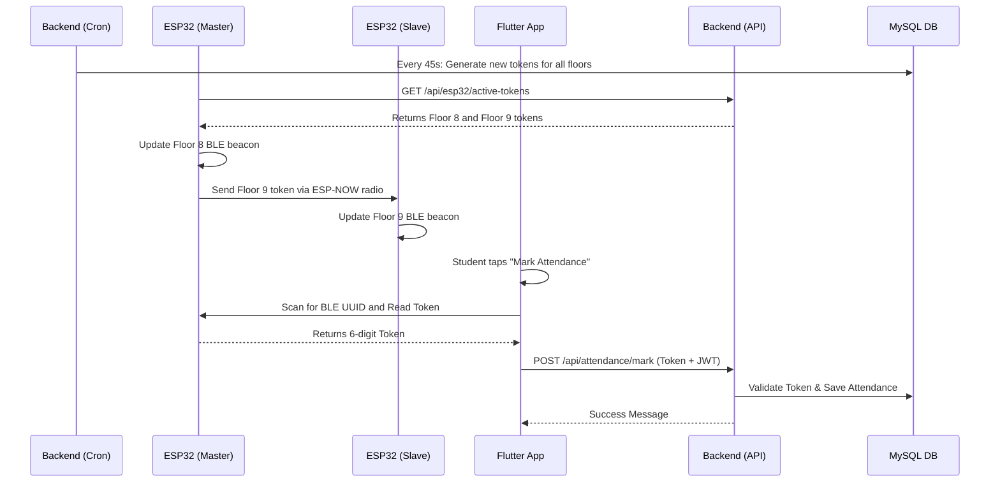

# HAMS: Junior Developer Guide

This guide is designed for junior developers to understand exactly how the Hostel Attendance Management System (HAMS) works from end-to-end. Your goal is to recreate this logic.

---

## 1. Overall System Flow 

Here is how all the pieces talk to each other:

---

## 2. The Frontend (Flutter) Flow

The frontend is a mobile app. Do not rely on web browsers for students, because Apple iOS blocks Web Bluetooth.

### **Flow 1: Login**
1. User enters their **Bank Code** and **Password**.
2. App sends a `POST /api/auth/login` request.
3. If successful, the backend returns a **JWT Token**.
4. **Save locally**: Save the JWT Token and student details using `shared_preferences`.
5. Every future API request must include the header: `Authorization: Bearer <JWT_TOKEN>`.

### **Flow 2: Marking Attendance (The core logic)**
When the student taps the big "Mark Attendance" button:
1. **Check API Status**: Call `GET /api/attendance/my-status`. If the window is closed, stop and show an error.
2. **Permissions**: Request Bluetooth and Location permissions. If denied, stop.
3. **BLE Scan**: Use `flutter_blue_plus` to scan for a Bluetooth device broadcasting the specific **Service UUID** (`4fafc201-1fb5-459e-8fcc-c5c9c331914b`).
   > [!WARNING]
   > Do NOT scan for the device name (e.g., "ESP32-Floor9"). Android heavily caches Bluetooth names as `N/A`, which will break your app. Always scan by Service UUID.
4. **Connect & Read**: Connect to the ESP32, read the Characteristic UUID (`beb5483e-36e1-4688-b7f5-ea07361b26a8`) to get the 6-digit token.
5. **Disconnect**: Instantly disconnect from the ESP32 so the next student in line can connect.
6. **Submit**: Call `POST /api/attendance/mark` with `{ "ble_token": "123456" }`. 
7. **Handle Auto-Logout**: If the API ever returns a `401 Unauthorized`, you must instantly clear `shared_preferences` and force the user back to the Login screen.

---

## 3. The Backend (Node.js) & DB Flow

The backend handles security, dynamic tokens, and database integrity.

### **Database Schema Constraints**
- `attendance_records` has a composite Primary Key on `(session_id, bank_code)`. This prevents a student from marking attendance twice in one day. 
- The `students.device_uuid` column must NOT be `NULL`. If you don't use device binding, insert an empty string `''` instead of `NULL` to prevent SQL crashes.

### **Middleware (auth.js)**
Create a `verifyStudent` middleware that:
1. Verifies the JWT signature.
2. **Crucial Security Step**: Queries the database to check if the student's `assigned_mobile` is still populated. If an admin deletes it, the middleware must return `401 Unauthorized` to force the app to log out.

### **Core API Endpoints**

| Method | Endpoint | Description |
|---|---|---|
| `POST` | `/api/auth/login` | Authenticates user. If student isn't in DB, fetch from external school API and insert them. Return JWT. |
| `GET` | `/api/esp32/active-tokens` | Returns current tokens. Secured by a hardcoded `x-api-key` header so only ESP32s can call it. |
| `POST` | `/api/attendance/mark` | Validates the token sent by Flutter matches the `current_token` stored in the `floors` table for the student's assigned floor. |
| `PUT` | `/api/attendance/schedule` | Floor leader updates times. Triggers a Firebase Cloud Messaging (FCM) push notification to all students. |

---

## 4. The Hardware (ESP32) Flow

Because Wi-Fi is weak in the hostel, the ESP32s use a **Master/Slave** relationship.

1. **Master (Floor 8)**: 
   - Connects to Wi-Fi.
   - Pings `/api/esp32/active-tokens` every 30 seconds.
   - Starts its BLE server and hosts the Floor 8 token.
   - Uses **ESP-NOW** to beam the Floor 9 token over radio waves to the Slave board.
2. **Slave (Floor 9)**: 
   - Never connects to Wi-Fi.
   - Listens on ESP-NOW. Because Wi-Fi routers change channels, it hops through channels 1-13 until it hears the Master.
   - Starts its BLE server and hosts the Floor 9 token.
3. **The Disconnect Bug Fix**: 
   - When a phone connects via BLE, the ESP32 stops advertising. You MUST write a `BLEServerCallbacks` class that triggers `BLEDevice::startAdvertising()` inside `onDisconnect()`. Otherwise, the ESP32 goes permanently invisible after the first student uses it.
